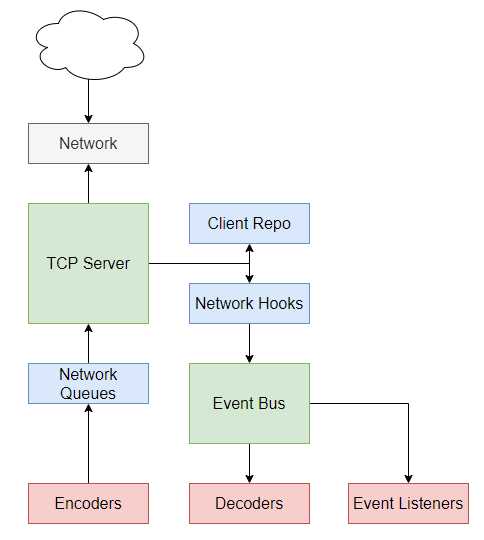
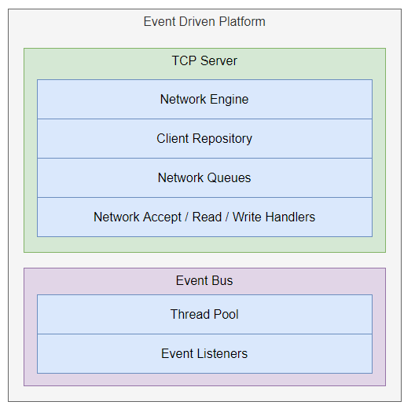

# Fiber
[ ](https://app.codeship.com/projects/287302) [](https://jitpack.io/#MrGraversen/Fiber)

## Install

You may use JitPack to install this from the GitHub releases.  
Add the following to your `pom.xml` if using Maven (click the little JitPack badge for other build systems):

```
<repositories>
	<repository>
		<id>jitpack.io</id>
		<url>https://jitpack.io</url>
	</repository>
</repositories>
```

```
<dependency>
    <groupId>com.github.MrGraversen.Fiber</groupId>
    <artifactId>fiber-core</artifactId>
    <version>0.1</version>
</dependency>
```
## What is Fiber?

_Fiber_ is a zero-dependency, event-driven TCP networking framework written in Java, based on the `java.nio` asynchronous I/O package.

It was started a while ago as a learning project for becoming more intimate with the challenges of concurrency in TCP networking frameworks.  
One of my favourite ways to learn the "how" and "why" of technology is to throw myself at the surrounding problems, and _solve them_.  

This project was inspired from NodeJS (its "event loop" processing model) and [Netty](https://netty.io/), in that it seeks to expose an event-driven network abstraction that never blocks.  
It is constructed by several levels of abstractions, allowing the user to choose freely how much "control" they want over the network engine implementation. 

### Goals

* Implement a multi-server, multi-client framework encapsulating somewhat complex asynchronous I/O concepts.
* Expose server internals using an event-driven programming model.
* Handle network client management (disconnect from both directions, attributes, etc).
* Provide a non-blocking, non-throttled network write interface.
* Avoid network client "modes" (clients and server are always allowed to write, irrespective of state).
* Provide configuration handles for server socket bind, buffer sizes, etc.

### Non-goals

* Creating a viable alternative to existing Java networking engines, such as [Netty](https://netty.io/).

In practice, you (and I) should use a well-established approach and technology to handle high-scale production-grade workloads.

## Design and Concepts

_Fiber_ builts on the general principle of asynchronous I/O, in that all network endpoints (clients) share the same resources.

The concepts of AIO introduces a number of constraints, the most central being that I/O should be as lean as possible, causing (ideally) zero side effects.  
Network reads and writes share a resource group, and any other operations are deferred to the event bus, where (by default) a thread count equal to the host's CPUs are present.
The outcomes of event listeners processing will therefore not have any effect on the I/O layer.  

Users of _Fiber_ are always able to request network writes without it blocking. The operation will simply be deferred until the I/O loop is available, or the client is available, whichever comes first.  

_Fiber_ employs what I like to call an "optimistic write" pattern: The client endpoint is always _assumed to be_ ready to receive data. If that is not the case, the operation is bounced
to a client-specific queue. Once that particular client has finished writing, the operation will be put back to the general network write operation queue.  
This approach ensures that any platform-specific limitations to enqueued network buffers will be handled gracefully, for example under Windows.



The general usage of _Fiber_ will involve three major concepts:
* **TCP Server**  
The central network engine of _Fiber_ and encapsulation of `java.nio` AIO concepts.
* **Event Bus**  
General purpose event bus to hand-off operations for long-running tasks.
* **Platform**  
An abstraction to allow both the TCP server and event bus to deal with their own concerns. Network hooks from the TCP server are transformed to events.

The user is free to specify their own implementations of most constructs of each concept, if special requirements arise.



## Examples

See `fiber-examples` project.
